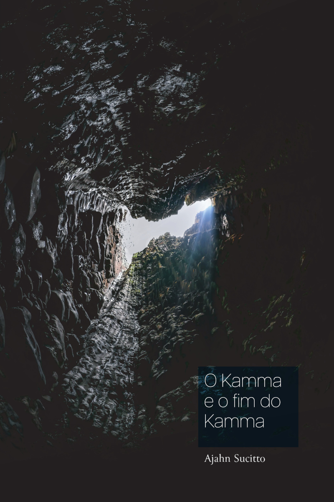

= O Kamma e o Fim do Kamma
:booktitle: {doctitle}
:author: Ajahn Sucitto
:creator: {author}
:version: v1.0
:revdate: 2023-12-23
:doctype: book
:lang: pt
:pubs-logo: sumedharama-logo-only-w100.png
:publisher-name: Publicações Sumedhārāma
:publisher-link-name: www.sumedharama.pt
:publisher-link-url: https://sumedharama.pt/
:source: https://forestsangha.org
:keywords: Ajahn Sucitto, Dhamma, Buddhism, RELIGION / Buddhism / Theravada
:copyright: CC-BY-NC-ND 4.0
:isbn: 978-989-8994-44-8
:identifier: isbn:{isbn}
:imagesdir: assets/photos/92dpi-ebook-sRGB
:includes: manuscript/asciidoc
:front-cover-image: 
:toc: left
:toc-title: Índice
:toclevels: 0

include::{includes}/titlepage.adoc[]

include::{includes}/00-prefacio.adoc[]

include::{includes}/00-nota-do-editor.adoc[]

include::{includes}/01-onde-existe.adoc[]

include::{includes}/02-kamma-luminoso.adoc[]

include::{includes}/03-kamma-da-meditacao.adoc[]

include::{includes}/04-kamma-e-memoria.adoc[]

include::{includes}/05-observar-o-mundo.adoc[]

include::{includes}/06-relacionamentos.adoc[]

include::{includes}/07-existe-um-fim.adoc[]

include::{includes}/glossary.adoc[]

include::{includes}/copyright.adoc[]
